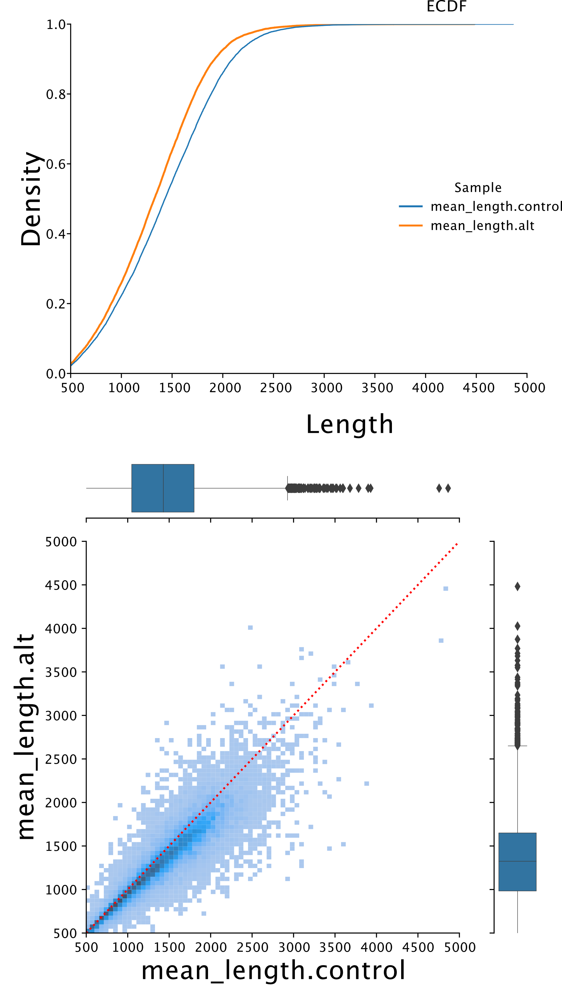
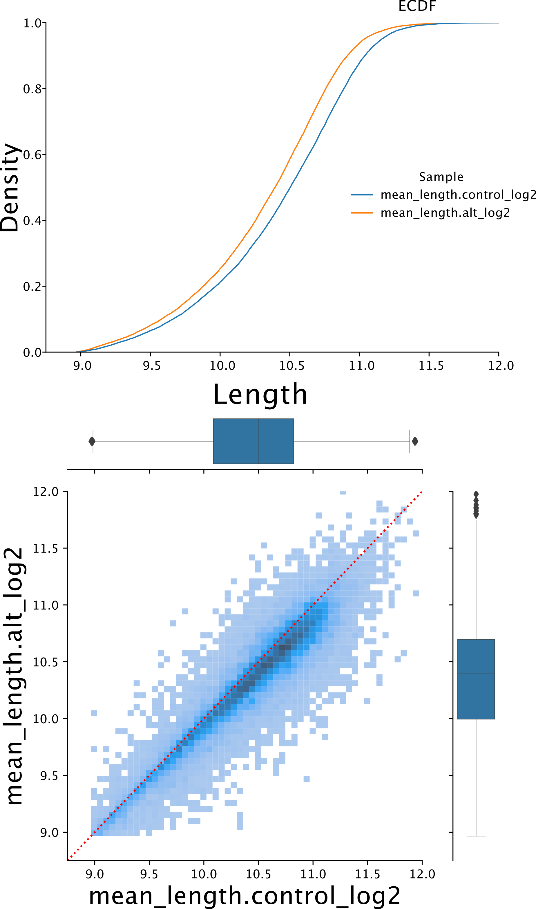

# NanopLen: Differential length analysis
Definition: NanopLen tests for differences in transcript length between different conditions in nanopore sequencing data.

# NanopLen differential length model:
NanopLen has the option to use three models: t-test, linear mixed model, or Wilcoxon test. Regardless of test used, the output is the pertaining statistic and p-value for each contig in the data. T-test and linear mixed model can include extra covariates but Wilcoxon cannot.
- t-test:
NanopLen models a simple linear regression for the effect of the condition on average length. If no extra covariates are supplied, this is mathematically equivalent to a t-test for difference in means.
- Linear Mixed Model:
The linear mixed model (LLM) uses the library ID as a random effect to control for library-specific batch effects. Otherwise, this uses the same model as in the t-test.
- Wilcoxon:
The Wilcoxon test is the nonparametric equivalent of the t-test for difference in means. This method is restricted to a two-level condition variable and no extra covariates.

We use a LMM over t-test because it can account for sample-specific batch effects and is just more powerful in general. LMM was also used over Wilcoxon test for similar reasons, but also because Wilcoxon cannot account for extra parameters. We still have it as an option for scenarios where the length distribution has very large outliers which would overinfluence the LMM.

# Installation

## Setting up the computational Environment and software requirements.
Following setup will be required to run the NanopLen as well as supporting scripts.
We have tested the scripts in the bash (x86_64-redhat-linux-gnu):
We suggest you clone this repostory into working folder to run test data and try the commands as well as utilise the acessory scripsts given here to process and create plots form demo data as described below.
User can setup the conda envirnment for better utilisation of the package ans associated scripts.
```
conda env create -f nanoplen_conda_env.yaml
```
After the conda envirnment is set, use the below command to install the nanoplen package (inside R).

## Install the NanopLen R package:
```
devtools::install_github("maragkakislab/NanopLen")
```

# Tutorial

## Input

NanopLen accepts two input files. The first file is TAB separated file that contains the length information. It consists of 3 columns: the sample name, the identifier (e.g. transcript name, used to aggregate lengths), and the length (trasncript length or polyA tail length). This file contaians all the read-lengths that are presenat in the sequencing file. The second file is the metadata file that describe the samples and the conditions in the experiment (information in TAB separated format). 

## Output

NanopLen will output a delimited file with information for each identifier per row with information on the change in length, its significance, and other descriptive statitsics: number of reads and mean length per condition.

Here we provide the step-by-step example of complete demo for NanopLen based analysis and plots. The example input and output files can be found in the 'examples' folder associated with this repository. We have provided
smaller size of files for demonstrations e.g. bam files. However, if you are able to generate the results from the given example data you should be able to analyze your own long read sequencing data.


### STEP 1: Read-length of individual transcripts and metadata files:
Generate the annotated reads (Transcripts) with respective length per sample from BAM/SAM files, which are extracted after base calling, mapping and alignment of direct RNA seq long read sequencing (other long read sequencing data will also work until it is in the required format as shown examples folder `NanopLen_input_format.tab`).

Starting with BAM/SAM files, we have three Control and three Treatment demo files in `demo_bamfiles` folder in examples:

```
 Control_1_demo.bam
 Control_2_demo.bam
 Control_3_demo.bam
 Treatment_1_demo.bam
 Treatment_2_demo.bam
 Treatment_3_demo.bam
```
To generate the list of transcript ids with length profile, we use the helper script `bam_to_readlength.py` in scripts folder on each BAM/SAM file e.g.,

Command:
```
./scripts/bam_to_readlength.py \
    --ifile example/demo_bamfiles/Control_1_demo.bam \
    --ref-col-name transcript \
    --len-col-name read_length \
    --opt-col-name sample \
    --opt-col-val Control_1_demo \
    --no-zeros \
    > example/demo_bam_to_transcriptlist/Control_1_demo_transcripts_list.tab
```

The output is as shown below, three columns with sample name (e.g. Control_1_demo as sample name), transcript IDs (e.g. ENST00000338700 etc) and respective read lengths (e.g. 5489 nucleotide long in first row).

```
sample	transcript	read_length
Control_1_demo	ENST00000338700	5489
Control_1_demo	ENST00000338700	4786
Control_1_demo	ENST00000338700	1991
Control_1_demo	ENST00000338700	2628
Control_1_demo	ENST00000338700	2107
Control_1_demo	ENST00000338700	1919
Control_1_demo	ENST00000521452	1975
Control_1_demo	ENST00000521452	1937
...
Control_1_demo	ENST00000405442	964
Control_1_demo	ENST00000405442	861
```

Similarly, all BAM/SAM files should be run with the above script to generate the required list of transcript IDs and their respective lengths. In our case we have used three Control and three Treatment demo files
All these files are to be concatenated into one large file with single header as shown in `NanopLen_input_format.tab`.
We can use `awk` to generate the required single file e.g.:

Command:

```
awk 'FNR>1 || NR==1' \
	file-readids_list.tab \
	examples/demo_bam_to_transcriptlist/Control_1_demo-readids_list.tab \
	examples/demo_bam_to_transcriptlist/Control_2_demo-readids_list.tab \
	examples/demo_bam_to_transcriptlist/Control_3_demo-readids_list.tab \
	examples/demo_bam_to_transcriptlist/Treatment_1_demo-readids_list.tab \
	examples/demo_bam_to_transcriptlist/Treatment_2_demo-readids_list.tab \
	examples/demo_bam_to_transcriptlist/Treatment_3_demo-readids_list.tab \
	> NanopLen_input_format.tab
```

Another file defining the meta information e.g. `metadata_format.tab` (demo file in examples folder) is required for the input of NanopLen, which defines the other relevant information about the experiment especially which samples are control and which are treatment etc.

```
sample	condition
Control_1_demo	control
Control_2_demo	control
Control_3_demo	control
Treatment_1_demo	treatment
Treatment_2_demo	treatment
Treatment_3_demo	treatment
```

### STEP 2. Executing NanopLen (here shown for Linear Mixed Model)
With both transcript length file (e.g `NanopLen_input_format.tab`) and meta data file (`metadata_format.tab`) ready, we are set to execute the NanopLen as shown below.

Command:

```
./scripts/diff_length.R \
	--data_path examples/NanopLen_input_format.tab \
	--metadata_path examples/metadata_format.tab \
	--baseline "control" \
	--test m \
	--logscale TRUE \
	--ofile examples/NanopLen_output_format_LinearMixedModel.tab
```

With proper input and parameters the file will generate the output as shown below. It contains eight columns that include:

1\) `name`(the name of the transcript),  
2\) `log2FC` (log2 fold change of length between the treatment and control groups),  
3 & 4) `pvalue` and `qvalue` for significance value or score,  
5 & 6) `n.control` and `n.alt` represent the number of reads or transcripts each read have in corresponding samples,  
7 & 8) `mean_length.control` and `mean_length.alt` are the average read length of the transcript in the respective samples.  
Example is shown below:

```
name	log2FC	pvalue	qvalue	n.control	n.alt	mean_length.control	mean_length.alt
ENST00000174653	-1.04679121971933	0.0222340654301579	0.0237163364588351	14	17	1802.64285714286	1130.47058823529
ENST00000222345	-1.21934507323735	3.14828699778755e-05	0.000755588879469013	39	33	1812.30769230769	1027.93939393939
ENST00000257468	-1.21184838201074	0.0123434414903834	0.0164579219871779	12	14	1301.25	559.142857142857
ENST00000258281	-1.0075796672931	0.0142801318054535	0.0180380612279412	14	15	2556.85714285714	1493.8
```
Additionally a warning file (`NanopLen_output_format_LinearMixedModel.tab_warnings.txt`) is generated with the warning etc. associated with the execution of the above programme.

### STEP 3. Post execution plots:
After successful execution of the NanopLen, and generating the results file we can view the results by plots using the `NanopLen_two_col_plots.py` script from examples folder. We have used `plots_input_demo.tab` data file to generate the plots (1. Proportion Plot & 2. Scatter-Density plot).
```
./scripts/NanopLen_two_col_plots.py \
	--ifile plots_input_demo.tab \
	--treatment mean_length.alt	\
	--control mean_length.control \
	--lowerlimit 500 \
	--upperlimit 5000 \
	--ofigure demo_plots.pdf
```
Note: In case of log scaled lmean lengths file make sure to provide proper column names as well as 'lowerlimit' and 'upperlimits' of X and Y-axis.





Likewise, if we use the data length in log2 scale we, can generate the plots in log scale as shown below. (3. Proportion Plot (log2 scaled ) & 2. Scatter-Density plot (log2 scaled )).



From the Proportion plot we can analyze the difference in the mean lengths between the two samples. Also, from the scatter-density plot we can analyze the spread of the mean length per transcript.
